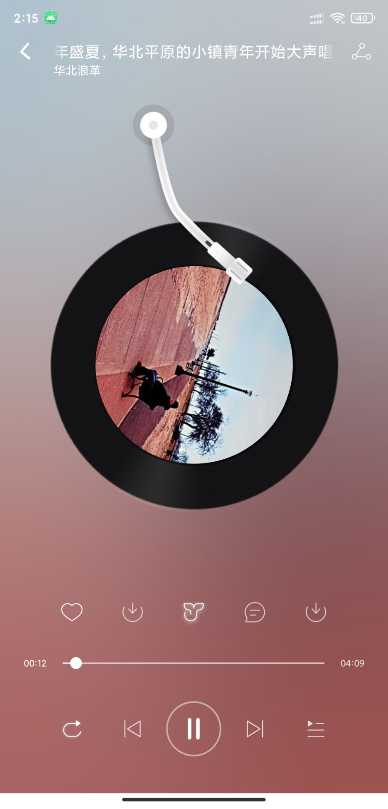
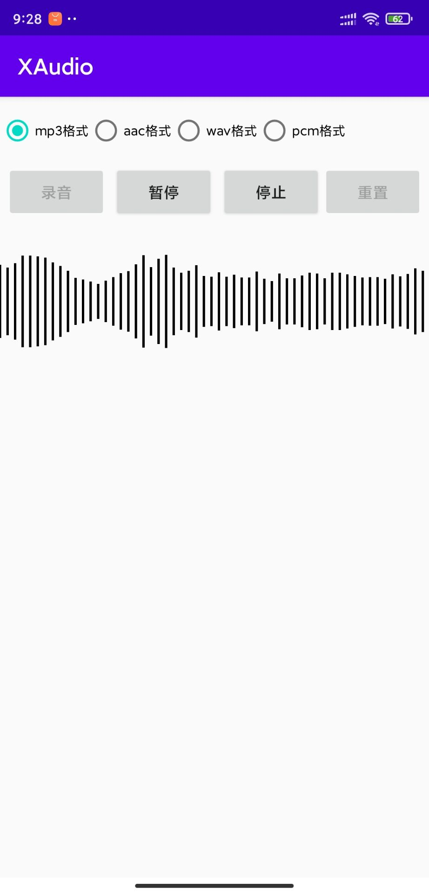

## XAudio

### XAudio：音频一行播放，Android音频录制，支持多种音频格式如mp3音频录制及可视化
---------------------------------

[  ](https://bintray.com/lucasxu/maven/xaudio/0.9.2/link)

* 一行播放网络音频
* 可快速实现音乐播放器功能
* 自带通知和服务，支持自定义
* 支持mp3、pcm、wav、aac格式音频录制
* 支持音波单双边显示（自动根据音频和控件高度调整波形高度）
* 支持获取声音大小
* 支持录制和播放的波形根据特征变颜色。
* 支持自定义音波图的线大小、方向和绘制偏移。


## 快速开始

#### 1. 在module下的build.gradle添加依赖

``` groovy
dependencies {

    // -------------------- 以下4个库是必须依赖的 ----------------------------
       implementation 'com.google.android.material:material:1.2.1'
       implementation 'androidx.recyclerview:recyclerview:1.1.0'
       implementation 'org.greenrobot:eventbus:3.2.0'
       implementation "com.github.bumptech.glide:glide:4.12.0"
    // -------------------- 以上4个库是必须依赖的 ----------------------------

    implementation 'com.lucas.xaudio:xaudio:0.9.2'

}
```

#### 2. 在app中注册

```java
public class myApp extends Application {
    @Override
    public void onCreate() {
        super.onCreate();
        //音频SDK初始化
        XAudio.getInstance().init(this);
    }
}
```

#### 3. 使用XAudio

播放音频

```java
        XAudio.getInstance()
                .addAudio(new AudioBean("https://sr-sycdn.kuwo.cn/resource/n2/33/25/2629654819.mp3"))
                .playAudio();
```
 录制音频
 ```java
        // 开始录音 默认数mp3格式
        mRecorder = new XRecorder("filePath:录音文件保存路径", "fileName:录音文件保存名称");
        try {
             mRecorder.start();
             ...
         } catch (IOException e) {
             e.printStackTrace();
             ...
         }

        ...
        //结束录音
        mRecorder.stop();

 ```

 以上就是XAudio最简单最核心的两个功能使用的介绍了，更多地功能比如：通知、服务、音频波形图、录制音频的格式和参数选择等等，可具体参考Demo源码。

<br/>

### 注意点&&常见问题：
<br/> 1 网络音频播放需要网络权限，音频录制需要存储读写和录音权限。权限申请请用户自行解决，所需权限可参考[AndroidManifest.xml](./app/src/main/AndroidManifest.xml)和Demo
<br/> 2 若网络音频无法播放，检查歌曲链接，是否是https链接，或是否配置了network_security_config.xml
  测试歌曲链接 [链接](https://sr-sycdn.kuwo.cn/resource/n2/33/25/2629654819.mp3)
<br/> 3 XRecorder参数中，所需的文件路径地址若不存在，需要自行创建，具体可参考demo
<br/> 4 若按照文档来还是报错：E/AndroidRuntime: FATAL EXCEPTION: main java.lang.NoSuchMethodError: No static method metafactory，请注意XAudio使用了Lambda，build.gradle中需加上1.8支持（可参考Demo）
<br/> 5 若依赖的三方库（如Glide等）版本冲突，可下载库自行依赖，修改三方库的依赖版本

### Demo
[Demo下载](./XAudioDemo.apk)
<br/>
或扫描下面的二维码安装

<br/>


## 效果显示
| 音频播放   | 音频录制  |
|:-----------:|:--------:|
| |  |


### QQ群，有兴趣的可以进来，有问题可以提问交流：317643862

----------------------------------------------------

### 0.9.0 (2020-02-16)

* 编译lame库，添加mp3、aac、wav、pcm格式录音，并增加录音音频波形图

### 0.8.0 (20120-01-15)

* 完成XAudio音频播放器功能

### 使用方法请参考demo


